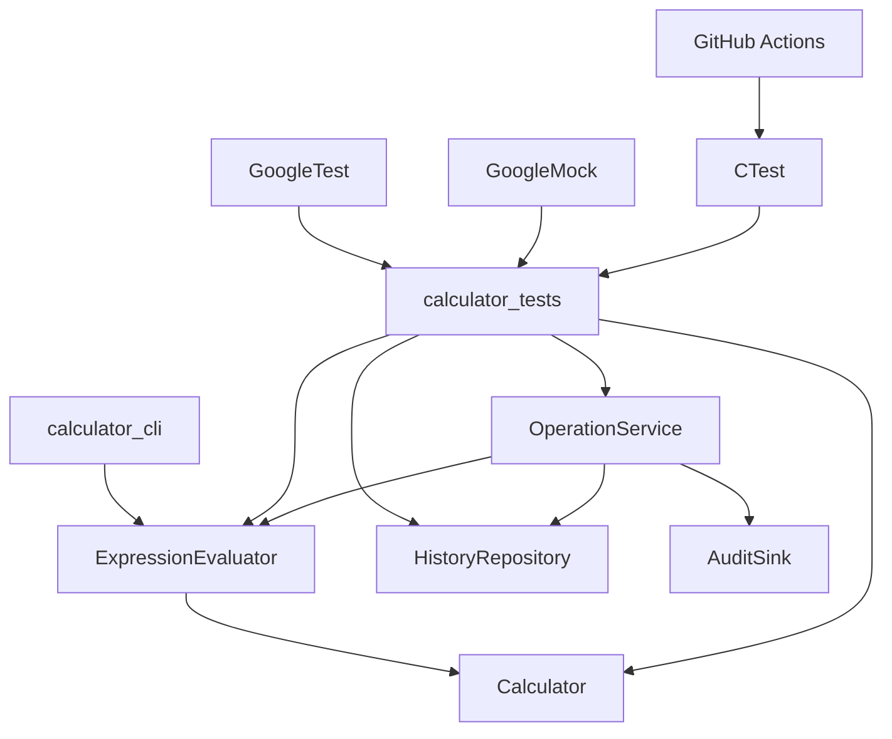
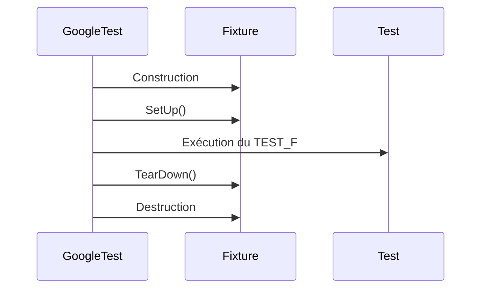

# GoogleTest avec C++17 et CMake — projet calculatrice du niveau débutant au niveau expert

Ce projet illustre l'utilisation de **GoogleTest** et **GoogleMock** avec un projet **C++17** construit avec **CMake**.

L'objectif n'est pas uniquement de montrer quelques assertions, mais de couvrir progressivement les usages importants dans un vrai projet C++ :

- assertions simples ;
- fixtures de test ;
- tests paramétrés ;
- tests combinatoires ;
- tests d'exceptions ;
- tests post mortem, aussi appelés **death tests** ;
- fixtures complexes avec fichiers temporaires ;
- tests typés ;
- mocks avec GoogleMock ;
- listener personnalisé ;
- métadonnées dans les rapports XML ;
- exécution filtrée ;
- rapports CI ;
- intégration GitHub Actions.

---

## 1. Structure du projet

```text
gtest-cpp-calculator-demo/
├── CMakeLists.txt
├── README.md
├── docs/
│   └── COMMANDS.md
├── include/
│   └── calculator/
│       ├── calculator.h
│       ├── expression_evaluator.h
│       ├── history_repository.h
│       └── operation_service.h
├── src/
│   ├── calculator.cpp
│   ├── expression_evaluator.cpp
│   ├── history_repository.cpp
│   ├── operation_service.cpp
│   └── main.cpp
├── tests/
│   ├── 01_beginner_assertions_test.cpp
│   ├── 02_simple_fixture_test.cpp
│   ├── 03_parameterized_test.cpp
│   ├── 04_combinatorial_test.cpp
│   ├── 05_exception_and_post_mortem_test.cpp
│   ├── 06_complex_fixture_test.cpp
│   ├── 07_typed_test.cpp
│   ├── 08_gmock_collaboration_test.cpp
│   └── 09_custom_listener_and_metadata_test.cpp
├── scripts/
│   ├── build-linux.sh
│   ├── build-windows.ps1
│   └── run-filter-examples.sh
└── .github/
    └── workflows/
        └── ci.yml
```

---

## 2. Architecture technique



Le code métier reste indépendant du framework de test. GoogleTest intervient uniquement dans le répertoire `tests/`.

---

## 3. Prérequis

### Linux

Installer au minimum :

```bash
sudo apt update
sudo apt install -y build-essential cmake git
```

### Windows

Installer :

- Visual Studio 2022 avec le workload **Desktop development with C++** ;
- CMake ;
- Git.

Dans un terminal **Developer PowerShell for Visual Studio**, les commandes CMake fonctionnent directement.

---

## 4. Compilation et exécution rapide

### Linux ou macOS

```bash
cmake -S . -B build -DCMAKE_BUILD_TYPE=Debug
cmake --build build --config Debug
ctest --test-dir build --output-on-failure
```

Ou avec le script :

```bash
./scripts/build-linux.sh
```

### Windows PowerShell

```powershell
cmake -S . -B build -DCMAKE_BUILD_TYPE=Debug
cmake --build build --config Debug
ctest --test-dir build --output-on-failure -C Debug
```

Ou avec le script :

```powershell
.\scripts\build-windows.ps1
```

---

## 5. Exécuter la calculatrice en ligne de commande

Après compilation :

### Linux

```bash
./build/calculator_cli 10 + 5
./build/calculator_cli 10 / 2
./build/calculator_cli 7 \* 6
```

### Windows

```powershell
.\build\Debug\calculator_cli.exe 10 + 5
.\build\Debug\calculator_cli.exe 10 / 2
.\build\Debug\calculator_cli.exe 7 * 6
```

---

## 6. Exécuter les tests directement avec GoogleTest

### Linux

```bash
./build/calculator_tests
```

### Windows

```powershell
.\build\Debug\calculator_tests.exe
```

Avec rapport XML :

```bash
./build/calculator_tests --gtest_output=xml:build/gtest-report.xml
```

---

## 7. Niveau débutant : assertions simples

Fichier :

```text
tests/01_beginner_assertions_test.cpp
```

Concepts illustrés :

- `TEST` ;
- `EXPECT_EQ` ;
- `ASSERT_FALSE` ;
- `EXPECT_DOUBLE_EQ` ;
- `EXPECT_NEAR` ;
- messages d'erreur personnalisés avec `<<`.

Exemple :

```cpp
TEST(BeginnerAssertions, ExpectEqChecksIntegerResult) {
    Calculator calculator;
    EXPECT_EQ(calculator.add(2, 3), 5);
    EXPECT_EQ(calculator.subtract(10, 4), 6);
}
```

Différence essentielle :

| Macro | Effet |
|---|---|
| `EXPECT_*` | Signale l'échec mais continue le test courant |
| `ASSERT_*` | Signale l'échec et arrête immédiatement le test courant |

---

## 8. Niveau intermédiaire : fixtures simples

Fichier :

```text
tests/02_simple_fixture_test.cpp
```

Une fixture évite de répéter la préparation commune à plusieurs tests.

```cpp
class CalculatorFixture : public ::testing::Test {
protected:
    void SetUp() override {
        calculator = Calculator{};
    }

    Calculator calculator;
};
```

Les tests utilisent ensuite `TEST_F` :

```cpp
TEST_F(CalculatorFixture, DivisionByZeroThrowsInvalidArgument) {
    EXPECT_THROW(calculator.divide(20, 0), std::invalid_argument);
}
```

Cycle de vie :



---

## 9. Tests paramétrés

Fichier :

```text
tests/03_parameterized_test.cpp
```

Les tests paramétrés permettent d'exécuter le même test avec plusieurs jeux de données.

```cpp
class AdditionParameterizedTest
    : public ::testing::TestWithParam<std::tuple<int, int, int>> {
protected:
    Calculator calculator;
};
```

Instanciation :

```cpp
INSTANTIATE_TEST_SUITE_P(
    NominalAndBoundaryValues,
    AdditionParameterizedTest,
    ::testing::Values(
        std::make_tuple(1, 2, 3),
        std::make_tuple(0, 0, 0),
        std::make_tuple(-5, 3, -2)
    )
);
```

Intérêt pédagogique :

- réduire la duplication ;
- rendre visibles les jeux de données ;
- couvrir valeurs nominales, limites et cas négatifs.

---

## 10. Tests avec combinatoire

Fichier :

```text
tests/04_combinatorial_test.cpp
```

GoogleTest fournit `::testing::Combine` pour produire un produit cartésien de valeurs.

```cpp
INSTANTIATE_TEST_SUITE_P(
    CartesianProduct,
    MultiplicationCombinatorialTest,
    ::testing::Combine(
        ::testing::Values(-3, -1, 0, 1, 3),
        ::testing::Values(-2, 0, 2)
    )
);
```

Cela génère automatiquement toutes les combinaisons :

```text
(-3, -2), (-3, 0), (-3, 2),
(-1, -2), (-1, 0), (-1, 2),
...
```

À utiliser avec prudence : la combinatoire peut exploser rapidement.

Bonne pratique : préférer une combinatoire ciblée, basée sur les classes d'équivalence et les valeurs limites.

---

## 11. Tests d'exception

Fichier :

```text
tests/05_exception_and_post_mortem_test.cpp
```

Exemples :

```cpp
EXPECT_THROW(calculator.divide(20, 0), std::invalid_argument);
EXPECT_THROW(calculator.add(std::numeric_limits<int>::max(), 1), std::overflow_error);
```

Pour vérifier le message exact :

```cpp
try {
    calculator.divide(10, 0);
    FAIL() << "Une exception était attendue";
} catch (const std::invalid_argument& ex) {
    EXPECT_STREQ(ex.what(), "division by zero");
}
```

---

## 12. Tests post mortem / death tests

Fichier :

```text
tests/05_exception_and_post_mortem_test.cpp
```

Un **death test** vérifie qu'un morceau de code termine le processus volontairement : `abort`, `exit`, assertion fatale, etc.

Exemple :

```cpp
TEST(PostMortemDeathTests, FatalDivisionByZeroLeavesDiagnosticMessage) {
    Calculator calculator;
    EXPECT_DEATH(
        calculator.terminateOnDivisionByZero(0),
        "POST_MORTEM: fatal division by zero"
    );
}
```

Dans ce projet, `terminateOnDivisionByZero` écrit un message dans `stderr`, puis appelle `std::abort()`.

```cpp
void Calculator::terminateOnDivisionByZero(int denominator) const {
    if (denominator == 0) {
        std::fprintf(stderr, "POST_MORTEM: fatal division by zero\n");
        std::abort();
    }
}
```

Exécution ciblée :

```bash
./build/calculator_tests --gtest_filter='*DeathTests*' --gtest_death_test_style=threadsafe
```

Les death tests sont utiles pour :

- vérifier les comportements fatals contrôlés ;
- sécuriser du code bas niveau ;
- tester des invariants non récupérables ;
- documenter les diagnostics produits avant terminaison.

Ils ne doivent pas remplacer les tests d'exception classiques.

---

## 13. Fixtures complexes

Fichier :

```text
tests/06_complex_fixture_test.cpp
```

Cette partie illustre :

- répertoire temporaire unique ;
- fichier CSV de persistance ;
- nettoyage dans `TearDown` ;
- service applicatif ;
- mock d'un sink d'audit ;
- vérification de persistance et d'interactions.

Extrait :

```cpp
class OperationServiceComplexFixture : public ::testing::Test {
protected:
    void SetUp() override {
        tempDirectory = makeUniqueTempDirectory();
        historyFile = tempDirectory / "history.csv";
        auditSink = std::make_shared<StrictMock<MockAuditSink>>();
    }

    void TearDown() override {
        std::error_code ignored;
        std::filesystem::remove_all(tempDirectory, ignored);
    }
};
```

Cette fixture est plus réaliste qu'une simple classe `CalculatorFixture`, car elle gère des ressources externes.

---

## 14. Tests typés

Fichier :

```text
tests/07_typed_test.cpp
```

Les tests typés permettent d'exécuter le même scénario sur plusieurs types C++.

```cpp
using NumericTypes = ::testing::Types<int, long long, double>;
TYPED_TEST_SUITE(AccumulatorTypedTest, NumericTypes);
```

Exemple d'usage :

```cpp
TYPED_TEST(AccumulatorTypedTest, AddsTwoValues) {
    this->accumulator.add(static_cast<TypeParam>(10));
    this->accumulator.add(static_cast<TypeParam>(5));
    EXPECT_EQ(this->accumulator.total(), static_cast<TypeParam>(15));
}
```

C'est utile pour tester :

- templates ;
- conteneurs génériques ;
- algorithmes paramétrés par type ;
- stratégies numériques.

---

## 15. GoogleMock

Fichier :

```text
tests/08_gmock_collaboration_test.cpp
```

GoogleMock permet de tester les collaborations entre objets.

Interface mockée :

```cpp
class AuditSink {
public:
    virtual ~AuditSink() = default;
    virtual void notifySuccess(const std::string& expression, int result) = 0;
    virtual void notifyFailure(const std::string& expression, const std::string& reason) = 0;
};
```

Mock :

```cpp
class MockAuditSinkForCollaboration final : public AuditSink {
public:
    MOCK_METHOD(void, notifySuccess, (const std::string& expression, int result), (override));
    MOCK_METHOD(void, notifyFailure, (const std::string& expression, const std::string& reason), (override));
};
```

Vérification :

```cpp
EXPECT_CALL(*audit, notifySuccess("3 + 4", 7));
```

Vérification d'ordre :

```cpp
{
    InSequence sequence;
    EXPECT_CALL(*audit, notifySuccess("1 + 1", 2));
    EXPECT_CALL(*audit, notifySuccess("2 + 2", 4));
}
```

---

## 16. Listener personnalisé et métadonnées

Fichier :

```text
tests/09_custom_listener_and_metadata_test.cpp
```

Le projet montre comment :

- ajouter un `Environment` global ;
- enregistrer des propriétés dans le rapport XML ;
- ajouter un listener d'événements de test.

Exemple :

```cpp
::testing::Test::RecordProperty("requirement", "CALC-ADD-001");
```

Ces métadonnées apparaissent dans le rapport XML GoogleTest.

---

## 17. Commandes GoogleTest avancées

Lister les tests :

```bash
./build/calculator_tests --gtest_list_tests
```

Filtrer :

```bash
./build/calculator_tests --gtest_filter='BeginnerAssertions.*'
```

Exclure les death tests :

```bash
./build/calculator_tests --gtest_filter='-*DeathTests*'
```

Répéter :

```bash
./build/calculator_tests --gtest_repeat=10
```

Mélanger :

```bash
./build/calculator_tests --gtest_shuffle --gtest_random_seed=42
```

Fail fast :

```bash
./build/calculator_tests --gtest_fail_fast
```

Rapport XML :

```bash
./build/calculator_tests --gtest_output=xml:build/gtest-report.xml
```

Mode death test plus robuste :

```bash
./build/calculator_tests --gtest_death_test_style=threadsafe
```

Shard pour parallélisation :

```bash
GTEST_TOTAL_SHARDS=4 GTEST_SHARD_INDEX=0 ./build/calculator_tests
```

---

## 18. Intégration CTest

Le fichier `CMakeLists.txt` utilise :

```cmake
enable_testing()
include(GoogleTest)
gtest_discover_tests(calculator_tests)
```

Avantages :

- CMake découvre les tests GoogleTest ;
- CTest peut les exécuter individuellement ;
- les IDE compatibles CMake affichent les tests ;
- GitHub Actions peut lancer `ctest` sans connaître les détails GoogleTest.

Exécution :

```bash
ctest --test-dir build --output-on-failure
```

Avec parallélisation :

```bash
ctest --test-dir build --output-on-failure -j 4
```

---

## 19. GitHub Actions

Le workflow se trouve ici :

```text
.github/workflows/ci.yml
```

Il exécute :

```text
checkout
→ configuration CMake
→ compilation
→ exécution CTest
→ exécution directe GoogleTest avec rapport XML
→ publication du rapport XML comme artifact
```

Matrice :

```yaml
os: [ubuntu-latest, windows-latest]
build_type: [Debug, Release]
```

Cela permet de vérifier le projet sur Linux et Windows, en Debug et Release.

---

## 20. Couverture de code

Une option CMake est prévue :

```bash
cmake -S . -B build -DCMAKE_BUILD_TYPE=Debug -DENABLE_COVERAGE=ON
cmake --build build
ctest --test-dir build --output-on-failure
```

Sous GCC/Clang, cela ajoute les flags :

```text
--coverage -O0 -g
```

Pour générer un rapport HTML, vous pouvez ajouter `lcov` et `genhtml` :

```bash
lcov --capture --directory build --output-file build/coverage.info
genhtml build/coverage.info --output-directory build/coverage-html
```

---

## 21. Progression pédagogique conseillée

| Étape | Fichier | Objectif |
|---|---|---|
| 1 | `01_beginner_assertions_test.cpp` | Comprendre `TEST`, `EXPECT`, `ASSERT` |
| 2 | `02_simple_fixture_test.cpp` | Mutualiser l'initialisation avec `TEST_F` |
| 3 | `03_parameterized_test.cpp` | Réduire la duplication avec des jeux de données |
| 4 | `04_combinatorial_test.cpp` | Tester des produits cartésiens ciblés |
| 5 | `05_exception_and_post_mortem_test.cpp` | Tester exceptions et crashs contrôlés |
| 6 | `06_complex_fixture_test.cpp` | Gérer fichiers temporaires et ressources externes |
| 7 | `07_typed_test.cpp` | Tester du code générique/template |
| 8 | `08_gmock_collaboration_test.cpp` | Vérifier les interactions avec GoogleMock |
| 9 | `09_custom_listener_and_metadata_test.cpp` | Ajouter rapports, propriétés et listener |

---

## 22. Bonnes pratiques illustrées

- Garder le code métier indépendant de GoogleTest.
- Ne pas mélanger logique métier et logique de test.
- Utiliser `EXPECT_*` pour accumuler les diagnostics.
- Utiliser `ASSERT_*` pour les préconditions indispensables.
- Nommer les tests en exprimant le comportement attendu.
- Utiliser des fixtures quand la préparation devient répétitive.
- Préférer les tests paramétrés aux copier-coller.
- Maîtriser la combinatoire pour éviter l'explosion du nombre de tests.
- Nettoyer les fichiers temporaires dans `TearDown`.
- Réserver les death tests aux comportements réellement fatals.
- Produire des rapports XML en CI.
- Utiliser GoogleMock pour les collaborations, pas pour mocker tout le domaine.

---

## 23. Dépannage

### CMake ne trouve pas GoogleTest

Par défaut, le projet télécharge GoogleTest via `FetchContent`. Il faut donc un accès Internet lors de la première configuration.

Alternative avec GoogleTest déjà installé :

```bash
cmake -S . -B build -DUSE_SYSTEM_GTEST=ON
```

### Les death tests ne passent pas dans certains environnements

Essayez :

```bash
./build/calculator_tests --gtest_filter='*DeathTests*' --gtest_death_test_style=threadsafe
```

### Sous Windows, l'exécutable n'est pas au même endroit

Avec Visual Studio, les exécutables sont généralement sous :

```text
build/Debug/
build/Release/
```

Avec Ninja ou Makefiles, ils sont souvent directement sous :

```text
build/
```

---

## 24. Résumé

Ce projet donne une base complète pour enseigner et pratiquer GoogleTest avec C++17 :

```text
Débutant
→ assertions simples
→ fixtures
→ paramètres
→ combinatoire
→ exceptions
→ death tests
→ fixtures complexes
→ tests typés
→ mocks
→ listeners
→ rapports CI
→ options avancées
```

Il peut être utilisé tel quel comme support de TP, base de démonstration en formation ou squelette de projet industriel C++.
